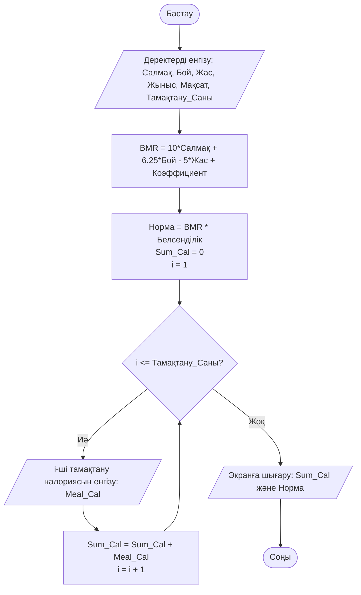
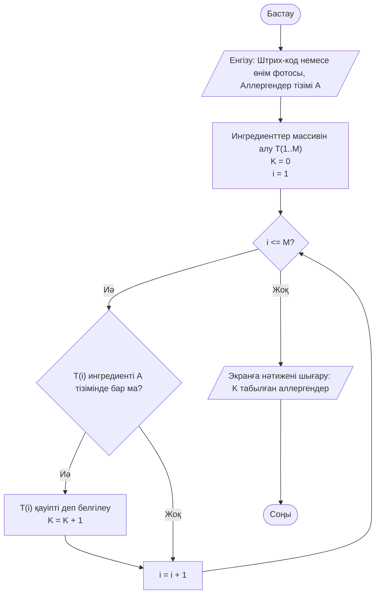
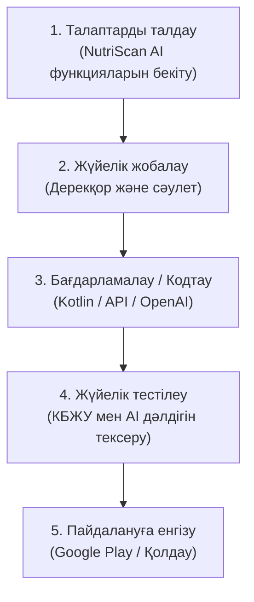
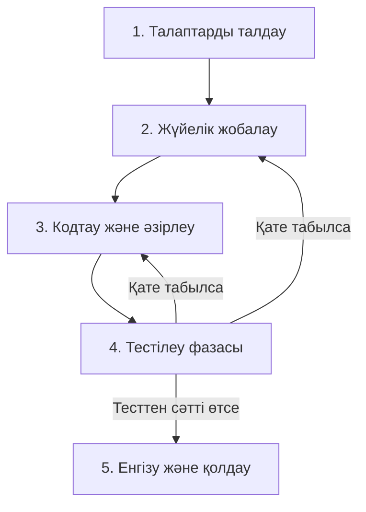
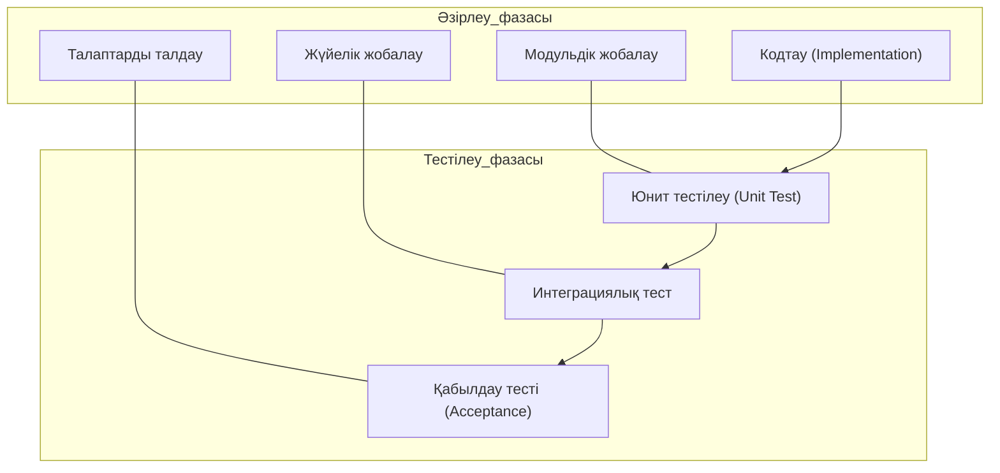
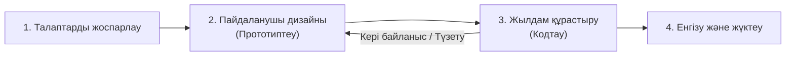
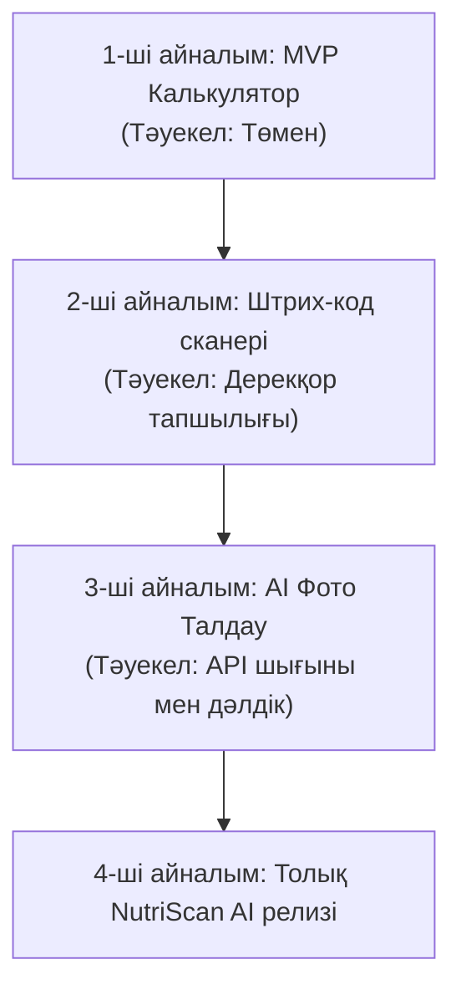
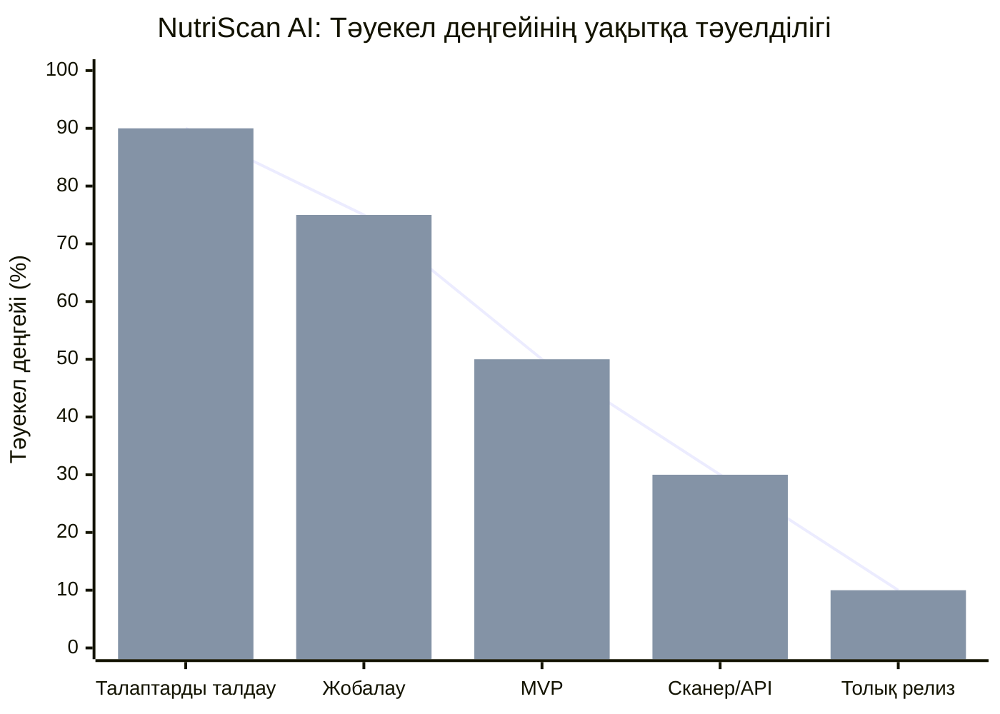
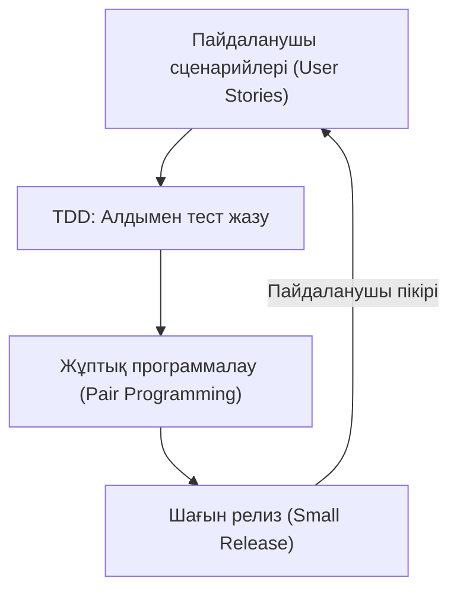

# Зертханалық жұмыс №3

## Бағдарламалық қамсыздандырудың өмірлік циклдерінің модельдері

**Жоба:** NutriScan AI: Personal Diet & Product Assistant

---

## Жұмыстың мақсаты

Бағдарламалық қамсыздандырудың өмірлік циклінің негізгі модельдерін зерттеу, олардың құрылымы мен ерекшеліктерін қарастыру және NutriScan AI жобасының әзірлеу процесіне бейімдеп модельдеу.

---

## 1. Алгоритмдердің блок-сұлбалары

### 1.1 Күнделікті калория нормасын есептеу алгоритмі

Алгоритм пайдаланушының салмағы, бойы, жасы, жынысы, белсенділік деңгейі және мақсаты туралы мәліметтер негізінде күнделікті калория нормасын есептеуді көрсетеді.

### 1.2 Өнім құрамындағы аллергендерді анықтау алгоритмі

Алгоритм өнім ингредиенттерін пайдаланушы көрсеткен аллергендер тізімімен салыстырып, қауіпті ингредиенттерді анықтау процесін көрсетеді.

---

## 2. Бағдарламалық қамсыздандырудың өмірлік цикл модельдері

### 2.1 Каскадты модель (Waterfall Model)

Каскадты модельде бағдарламалық өнімді әзірлеу кезеңдері бірінен кейін бірі ретімен орындалады.

### 2.2 Кері байланысы бар каскадты модель

Бұл модель қате анықталған жағдайда алдыңғы жобалау немесе әзірлеу кезеңіне қайта оралуға мүмкіндік береді.

### 2.3 V-тәрізді модель (V-Model)

V-Model әзірлеудің негізгі кезеңдерін оларға сәйкес тестілеу кезеңдерімен байланыстырады.

### 2.4 RAD — Rapid Application Development

RAD прототиптерді жылдам әзірлеуге және кері байланыс негізінде жүйені жетілдіруге бағытталған.

### 2.5 Шиыршықты модель (Spiral Model)

NutriScan AI жобасы бірнеше айналым арқылы кезең-кезеңімен дамытылады.

### 2.6 Тәуекел деңгейінің әзірлеу уақытына тәуелділігі

Жоба дамыған сайын белгісіздік азайып, тәуекел деңгейінің төмендеуі көрсетілді.

### 2.7 Экстремалды бағдарламалау (Extreme Programming, XP)

XP қысқа әзірлеу циклдеріне, тестілеуге және пайдаланушының тұрақты кері байланысына негізделеді.

---

## Қорытынды

Зертханалық жұмыс барысында бағдарламалық қамсыздандырудың өмірлік циклінің негізгі модельдері қарастырылып, NutriScan AI жобасының мысалында бейімделді.

Waterfall, кері байланысы бар Waterfall, V-Model, RAD, Spiral және Extreme Programming модельдерінің құрылымдары диаграммалар арқылы көрсетілді. Сонымен қатар NutriScan AI жүйесіне қатысты алгоритмдердің блок-сұлбалары және жобаны әзірлеу кезіндегі тәуекел деңгейінің өзгеру графигі құрылды.

Нәтижесінде бағдарламалық өнімді әртүрлі тәсілдермен әзірлеу кезеңдері мен модельдердің негізгі ерекшеліктері қарастырылды.
