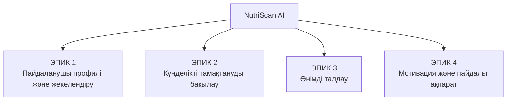
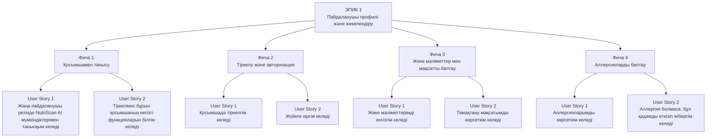
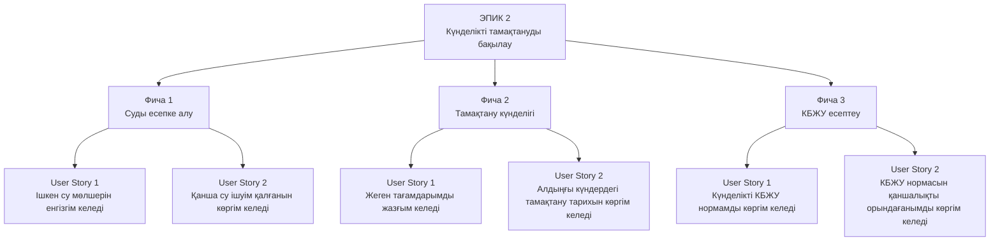
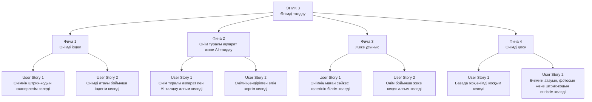
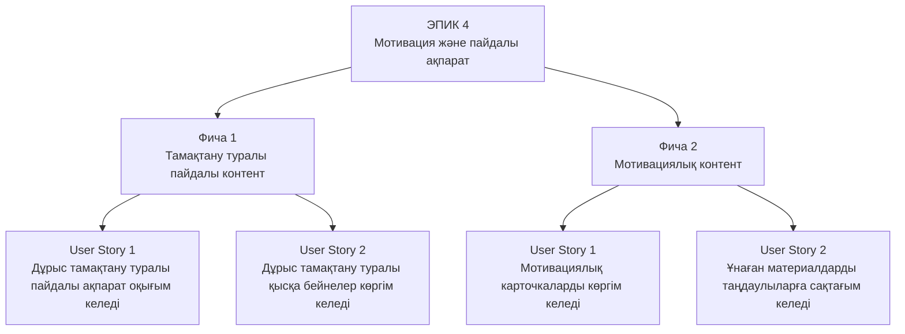

# Зертханалық жұмыс №4

## Бағдарламалық жоба талаптарының картасын құру: Epic, Feature және User Story

**Жоба:** NutriScan AI: Personal Diet & Product Assistant

---

## Жұмыстың мақсаты

NutriScan AI жүйесіне қойылатын талаптарды иерархиялық түрде құрылымдау, жобаның негізгі Epic және Feature элементтерін анықтау, User Story құрастыру және олар үшін Acceptance Criteria әзірлеу.

---

## 1. NutriScan AI Product Map

NutriScan AI жүйесінің талаптары төрт негізгі Epic бойынша құрылымдалды:

- **Epic 1:** Пайдаланушы профилі және жекелендіру
- **Epic 2:** Күнделікті тамақтануды бақылау
- **Epic 3:** Өнімді талдау
- **Epic 4:** Мотивация және пайдалы ақпарат

---

## 2. Epic → Feature → User Story

### 2.1 Epic 1 — Пайдаланушы профилі және жекелендіру

### 2.2 Epic 2 — Күнделікті тамақтануды бақылау

### 2.3 Epic 3 — Өнімді талдау

### 2.4 Epic 4 — Мотивация және пайдалы ақпарат

---

# 3. Acceptance Criteria

## 3.1 Су ішу прогресін бақылау

**User Story:**  
Пайдаланушы ретінде күнделікті нормаға дейін қанша су ішуім қалғанын көргім келеді, себебі өз прогресімді бақылағым келеді.

- Күнделікті су нормасы көрсетіледі.
- Ішілген су мөлшері көрсетіледі.
- Қалған су мөлшері көрсетіледі.
- Прогресс пайызбен көрсетіледі.
- Су қосылған кезде көрсеткіштер автоматты түрде жаңартылады.

---

## 3.2 Өнімнің штрих-кодын сканерлеу

**User Story:**  
Пайдаланушы ретінде өнімнің штрих-кодын сканерлегім келеді, себебі ақпаратты қолмен енгізбей тез тапқым келеді.

- Штрих-код сканерін ашуға болады.
- Камера штрих-кодты таниды.
- Өнім деректер қорынан ізделеді.
- Өнім табылса, ақпарат 3 секундтан аспайтын уақытта көрсетіледі.
- Өнім табылмаса, оны базаға қосу ұсынылады.

---

## 3.3 Жаңа өнімді базаға қосу

**User Story:**  
Пайдаланушы ретінде базада жоқ жаңа өнімді қосқым келеді.

- «Өнімді қосу» батырмасы көрсетіледі.
- Жаңа өнімді қосу формасы ашылады.
- Атауы, фотосы және штрих-коды енгізіледі.
- Мәліметтерді сақтауға болады.
- Сәтті сақталғаны туралы хабарлама көрсетіледі.

---

## 3.4 Өнім бойынша жеке ұсыныс

**User Story:**  
Пайдаланушы ретінде өнімнің маған сәйкес келетін-келмейтіні туралы ұсыныс алғым келеді.

- Өнімнің сәйкес келетін-келмейтіні көрсетіледі.
- Нәтиженің себебі түсіндіріледі.
- Ұсыныс пайдаланушының мақсатын ескереді.
- КБЖУ көрсеткіштері мен аллергиялары ескеріледі.

---

## 3.5 Таңдаулыларға сақтау

**User Story:**  
Пайдаланушы ретінде ұнаған мотивациялық материалдарды таңдаулыларға сақтағым келеді.

- Әр карточкада «Таңдаулы» батырмасы болады.
- Материал таңдаулыларға сақталады.
- Қосымшаға қайта кіргеннен кейін де сақталады.
- Таңдаулы материалдар жоғарыда көрсетіледі.
- Материалды таңдаулылардан алып тастауға болады.

---

## 4. Definition of Done (DoD)

User Story аяқталды деп есептеледі, егер:

- функция талаптарға сәйкес жүзеге асырылса;
- Acceptance Criteria толық орындалса;
- функция тестілеуден өтсе;
- негізгі қателер түзетілсе;
- интерфейс жоба дизайнына сәйкес болса;
- функция жүйенің басқа бөліктерімен дұрыс жұмыс істесе.

---

## 5. Product Backlog

NutriScan AI Product Backlog негізгі бағыттары:

1. Пайдаланушы профилі және жекелендіру
2. Күнделікті тамақтануды бақылау
3. Өнімді іздеу және сканерлеу
4. AI арқылы өнімді талдау
5. Жеке ұсыныстар
6. Жаңа өнімді қосу
7. Пайдалы және мотивациялық контент
8. Таңдаулыларды басқару

---

## 6. DEEP қағидалары

Product Backlog келесі DEEP қағидаларына сәйкес ұйымдастырылады:

- **D — Detailed appropriately:** элементтер қажетті деңгейде егжей-тегжейлі сипатталады.
- **E — Estimated:** элементтердің күрделілігі мен орындалу уақыты бағаланады.
- **E — Emergent:** Backlog жоба дамыған сайын өзгеріп, толықтырылуы мүмкін.
- **P — Prioritized:** элементтер маңыздылығына қарай басымдықпен реттеледі.

---

## Қорытынды

Зертханалық жұмыс барысында NutriScan AI жобасының талаптары **Epic → Feature → User Story → Acceptance Criteria** құрылымы бойынша ұйымдастырылды.

Төрт негізгі Epic анықталып, олардың Feature және User Story элементтері құрылды. Бес негізгі User Story үшін Acceptance Criteria анықталды. Сонымен қатар Definition of Done, Product Backlog және DEEP қағидалары қарастырылды.

Нәтижесінде NutriScan AI жобасын әрі қарай әзірлеуге арналған құрылымдалған талаптар картасы қалыптастырылды.
